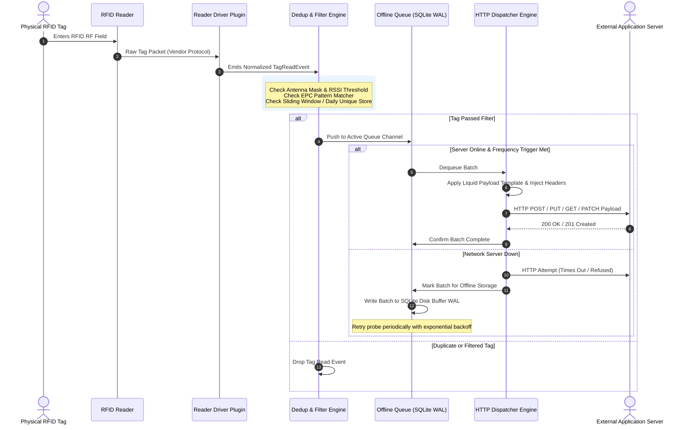

# 📐 OpenRFID Middleware - Architectural Specifications

## Overview

OpenRFID Middleware is designed with a **decoupled, event-driven, pipeline-based architecture**. It separates hardware interaction, tag processing, payload transformation, offline queueing, and network transport into independent modular components.

---

## 🏗️ High-Level System Architecture

```
                                  ┌───────────────────────────────────────────────┐
                                  │           OpenRFID Middleware Engine          │
                                  └───────────────────────┬───────────────────────┘
                                                          │
┌────────────────────────┐      ┌─────────────────────────▼───────────────────────┐      ┌────────────────────────┐
│   Physical Readers     │      │         1. Driver Ingestion Layer               │      │  Configuration Store   │
│                        │      │                                                 │      │                        │
│ • Identium 4-Port      ├─────►│ • IReaderProvider / IReaderConnection         │◄────┤ • json/yaml config     │
│ • Impinj LTK/Octane    │      │ • Protocol Adapters (LLRP, Native, Socket)     │      │ • Validation schema    │
│ • Zebra FX Series      │      │ • Auto-Reconnect Watchdog                       │      │ • Hot-Reload Engine    │
│ • Generic Serial/TCP   │      └─────────────────────────┬───────────────────────┘      └────────────────────────┘
└────────────────────────┘                                │ TagReadEvent Stream
                                ┌─────────────────────────▼───────────────────────┐
                                │        2. Filtering & Dedup Engine              │
                                │                                                 │
                                │ • Sliding Window Dedup Filter                   │
                                │ • Daily/Shift Unique Tag Registry               │
                                │ • Date/Time Schedule & EPC Pattern Matcher      │
                                │ • RSSI & Antenna Mask Filter                    │
                                └─────────────────────────┬───────────────────────┘
                                                          │ Filtered Tag Stream
                                ┌─────────────────────────▼───────────────────────┐
                                │        3. Resilience & Offline Buffer           │
                                │                                                 │
                                │ • Channel-Based Memory Buffer                   │
                                │ • SQLite WAL Disk Queue (Offline Protection)    │
                                │ • Rate Limiter & Replay Controller              │
                                └─────────────────────────┬───────────────────────┘
                                                          │ Batch Payload Trigger
                                ┌─────────────────────────▼───────────────────────┐
                                │       4. Payload Engine & Server Dispatcher     │
                                │                                                 │
                                │ • Templating Engine (Liquid/Handlebars/JSON)    │
                                │ • HTTP Method Dispatcher (GET/POST/PUT/PATCH)   │
                                │ • Dynamic Header & Auth Injector                │
                                │ • MQTT / WebSockets Publisher                   │
                                └─────────────────────────┬───────────────────────┘
                                                          │
                                                          ▼
                                ┌─────────────────────────────────────────────────┐
                                │         External Server / Endpoint              │
                                └─────────────────────────────────────────────────┘
```

---

## 🧩 Key Architecture Components

### 1. Ingestion & Reader Plugin Layer (`OpenRFID.Core.Drivers`)
- **Plugin Interface (`IReaderProvider`)**: Standard interface that all reader drivers implement.
- **Normalization**: Translates raw vendor bytes into standardized `TagReadEvent` objects.
- **Health Watchdog**: Continuously monitors connection status, emits diagnostic telemetry, and handles automatic socket re-establishment with exponential backoff logic.

### 2. Tag Processing & Deduplication Pipeline (`OpenRFID.Core.Pipeline`)
- **Pipeline Processing Chain**: Implements chain-of-responsibility or reactive extensions pattern (`IObservable<TagReadEvent>`).
- **Deduplication Engine**:
  - *Sliding Window*: Uses a thread-safe sliding memory cache (LRU / memory-mapped map) with configurable TTL.
  - *Daily Unique Store*: Maintains daily EPC hash sets, resetting automatically on day rollover (00:00 or shift boundary).
  - *Schedule Window*: Evaluates cron/time expressions to suppress or pass tags based on date/time bounds.
  - *Metadata Filtering*: Evaluates EPC Regex, RSSI bounds, and antenna bitmasks.

### 3. Resilience & Persistence Layer (`OpenRFID.Core.Storage`)
- **Memory Queue**: Uses high-performance System.Threading.Channels or lock-free ring buffer for zero-allocation tag throughput.
- **Disk Offline Buffer**: Powered by SQLite in Write-Ahead Logging (WAL) mode. When the remote server is unreachable, tags spill over to disk transactionally.
- **Playback Engine**: When connection is restored, a background worker drains disk buffers in batched transactions with rate limits.

### 4. Payload Generator & Server Dispatcher (`OpenRFID.Core.Dispatch`)
- **HTTP Method Adapter**: Configured to execute `POST`, `PUT`, `GET`, or `PATCH`.
- **Dynamic Header Provider**: Supports static headers plus dynamic headers generated per request (e.g. current UTC timestamp, signature hash, token renewal).
- **Template Engine**: Uses Liquid/Handlebars dynamic templates. Allows custom body formats (JSON array, JSON object wrapper, URL encoded form string, XML, CSV).

### 5. Management API & Dashboard UI (`OpenRFID.Core.Management`)
- **Embedded Web Server**: Light-weight embedded HTTP server providing REST API and WebSockets endpoints.
- **Cross-Platform UI**: Native desktop shell or web front-end for configuration, live monitoring, and logging.

---

## 🔄 Sequence Diagram: End-to-End Tag Lifecycle



---

## ⚡ Performance Targets & Hardware Requirements

- **Tag Throughput**: Up to 5,000 tag reads per second per core.
- **Deduplication Latency**: < 1 ms per tag evaluation.
- **Memory Footprint**: < 60 MB RAM baseline.
- **Disk Queue Capacity**: Up to 50,000,000 buffered offline tags on SQLite.
