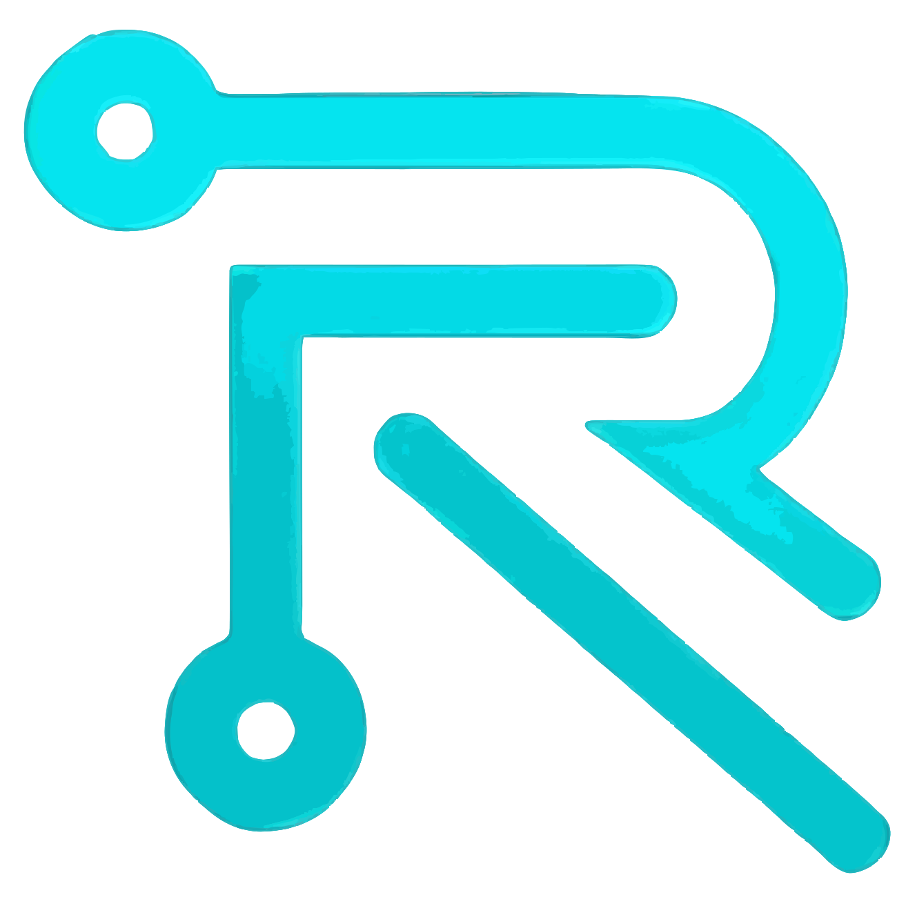
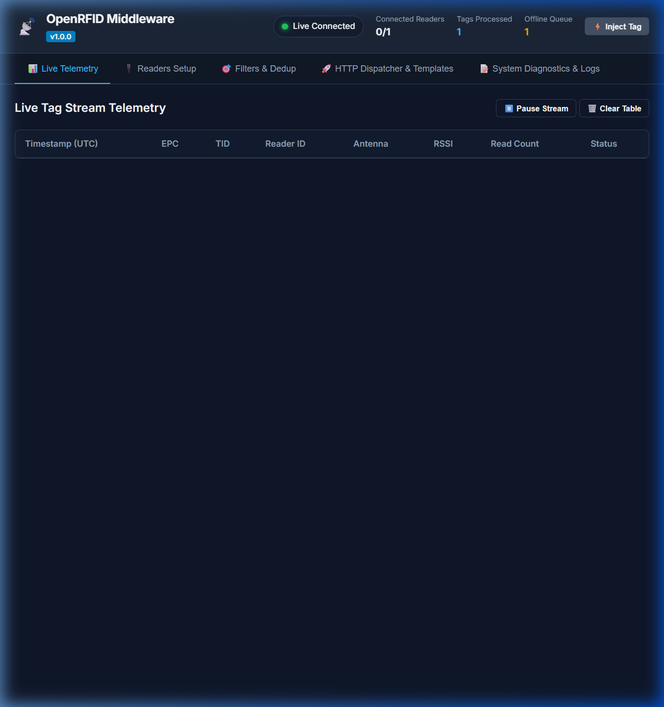
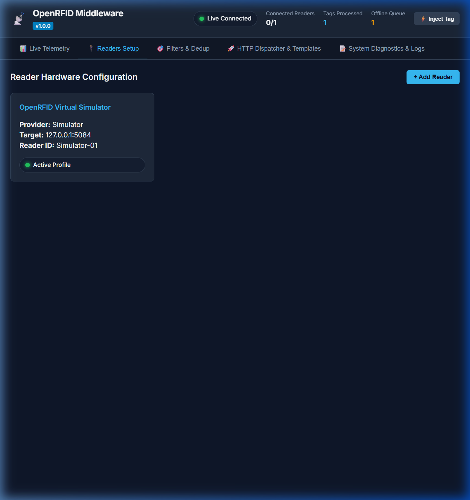
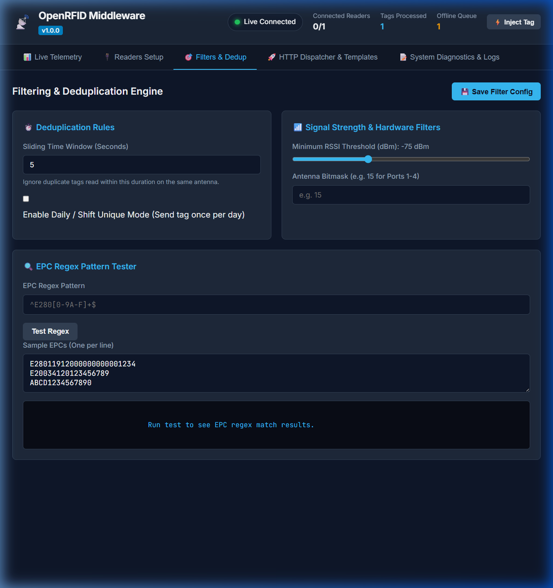
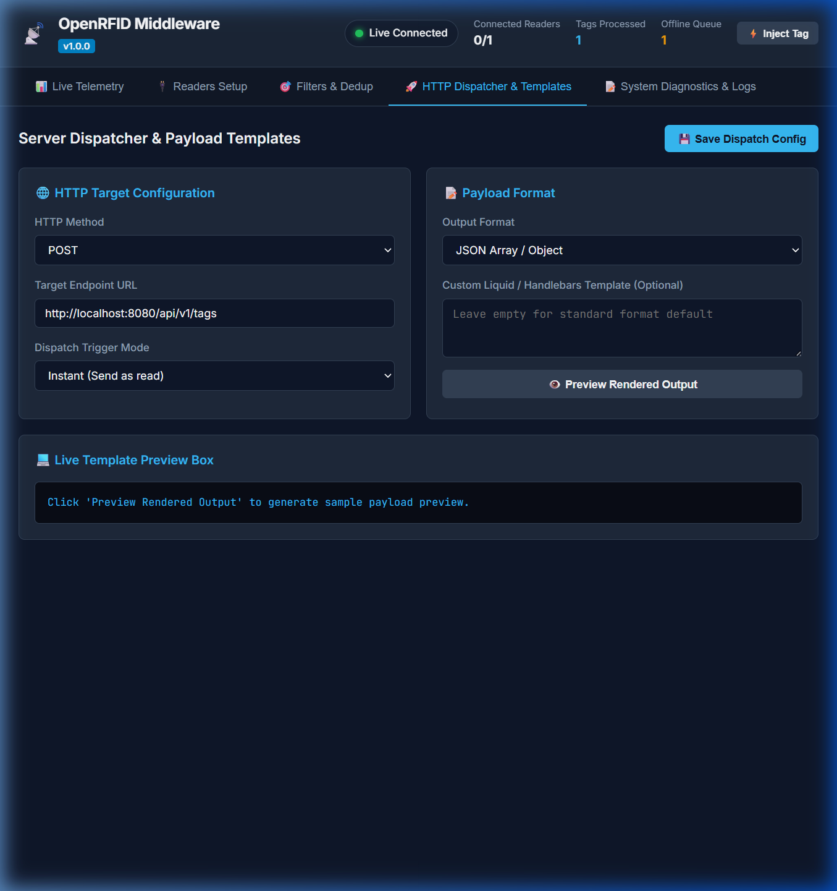
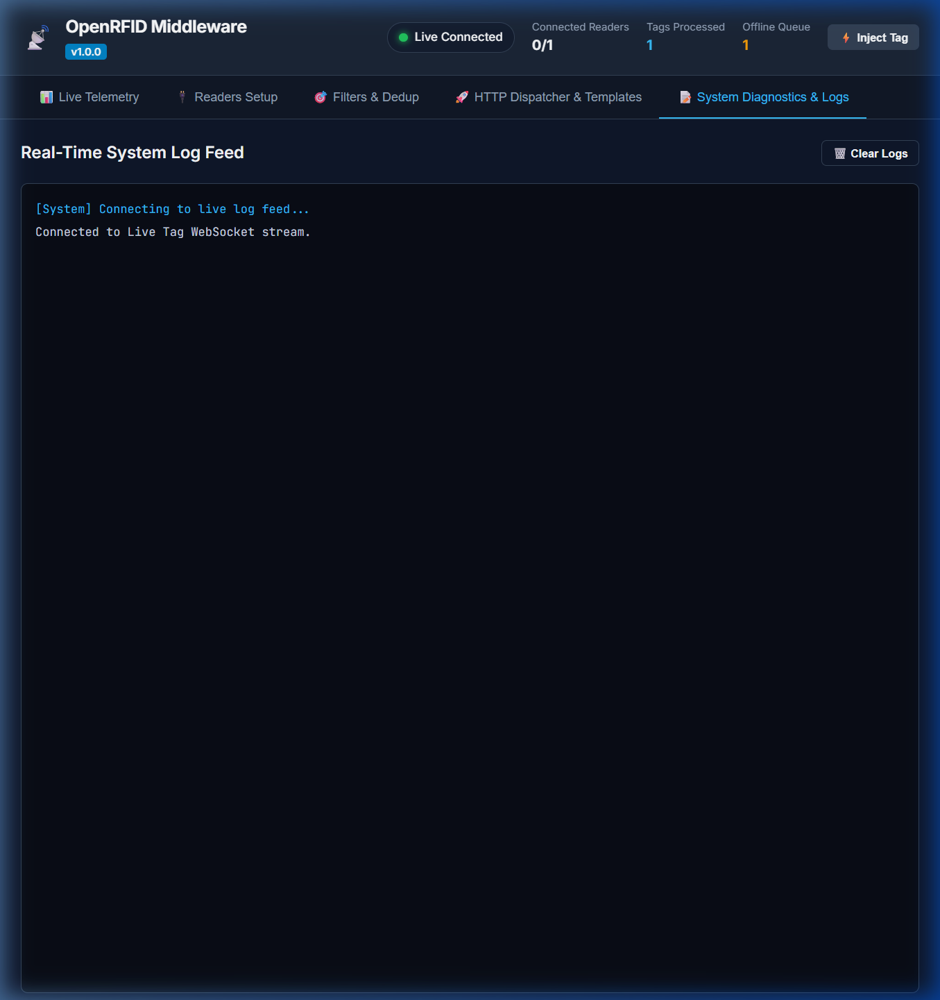
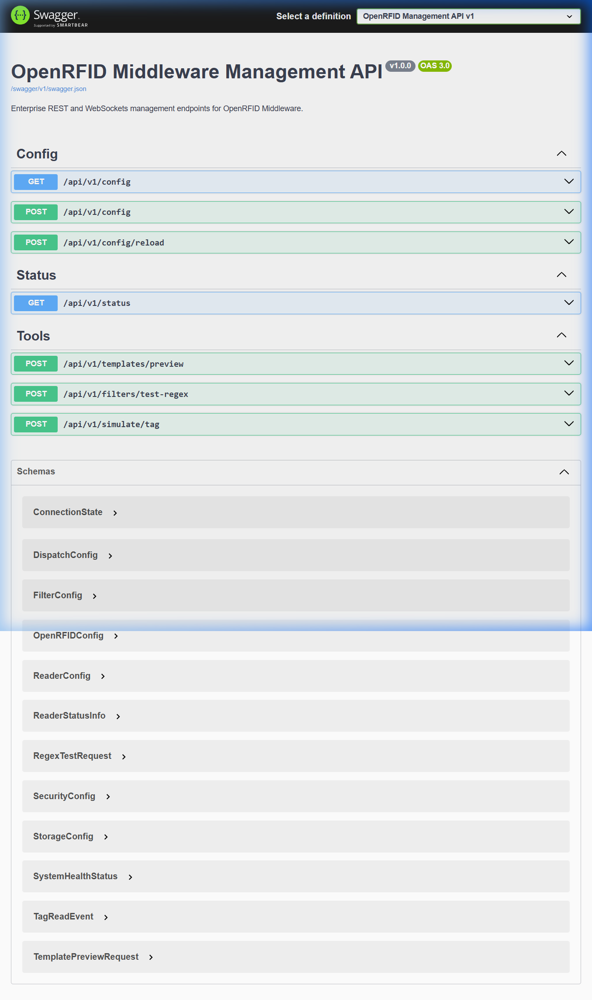

<p align="center">
  
</p>

# OpenRFID Middleware User Guide & Use Cases 📡

> **Universal, Enterprise-Grade, Open-Source RFID Middleware User Guide**<br>
> Maintained & Supported by [**RFID Software India Private Limited**](https://rfidsoftwares.com)

Welcome to the **OpenRFID Middleware User Guide**. This document provides step-by-step instructions on how to install, run, configure, and use OpenRFID Middleware locally, along with detailed walkthroughs for all core enterprise use cases.

---


## 📋 Table of Contents

1. [Overview & Architecture](#-overview--architecture)
2. [Prerequisites & System Requirements](#-prerequisites--system-requirements)
3. [Quick Start: Running OpenRFID Middleware Locally](#-quick-start-running-openrfid-middleware-locally)
   - [Method A: Using .NET CLI](#method-a-using-net-cli)
   - [Method B: Using Hardware Simulator](#method-b-using-hardware-simulator)
   - [Method C: Using Docker & Docker Compose](#method-c-using-docker--docker-compose)
4. [Use Case Walkthroughs](#-use-case-walkthroughs)
   - [Use Case 1: Real-Time Tag Stream Telemetry](#use-case-1-real-time-tag-stream-telemetry)
   - [Use Case 2: Multi-Vendor Reader Hardware Setup](#use-case-2-multi-vendor-reader-hardware-setup)
   - [Use Case 3: Intelligent Filtering & Deduplication Rules](#use-case-3-intelligent-filtering--deduplication-rules)
   - [Use Case 4: Dynamic HTTP Payload Templating & Dispatch](#use-case-4-dynamic-http-payload-templating--dispatch)
   - [Use Case 5: Real-Time System Diagnostics & WebSocket Logging](#use-case-5-real-time-system-diagnostics--websocket-logging)
   - [Use Case 6: REST API Management & OpenAPI/Swagger Interface](#use-case-6-rest-api-management--openapiswagger-interface)
5. [Troubleshooting & FAQs](#-troubleshooting--faqs)

---

## 🏗️ Overview & Architecture

OpenRFID Middleware acts as the intelligent bridge between physical RFID reader hardware (e.g. Zebra, Impinj, Identium, LLRP, Sockets, MQTT) and upstream enterprise applications (ERPs, WMS, Cloud APIs).

```
┌─────────────────────────────────────────────────────────────┐
│                       RFID HARDWARE                         │
│   Zebra FX9600 │ Impinj Speedway │ Identium │ Simulator    │
└──────────────────────────────┬──────────────────────────────┘
                               │ TCP / IP / Serial / LLRP
                               ▼
┌─────────────────────────────────────────────────────────────┐
│                    OPENRFID MIDDLEWARE                      │
│                                                             │
│   ┌────────────────┐   ┌─────────────────┐                  │
│   │ Reader Plugins │──>│ Filter & Dedup  │                  │
│   └────────────────┘   └────────┬────────┘                  │
│                                 ▼                           │
│   ┌────────────────┐   ┌─────────────────┐                  │
│   │ HTTP / MQTT    │<──│ SQLite Offline  │                  │
│   │ Dispatcher     │   │ Resilience Queue│                  │
│   └───────┬────────┘   └─────────────────┘                  │
└───────────┼─────────────────────────────────────────────────┘
            │ HTTP POST/PUT/GET/PATCH | WebSockets | MQTT
            ▼
┌─────────────────────────────────────────────────────────────┐
│                  UPSTREAM ENTERPRISE APP                    │
│        REST Backend │ WMS / ERP │ Cloud Analytics           │
└─────────────────────────────────────────────────────────────┘
```

---

## ⚙️ Prerequisites & System Requirements

Before running OpenRFID Middleware locally, ensure you have the following installed:

- **.NET SDK**: `.NET 10.0 SDK` (or .NET 8.0+ compatible build target).
- **Git**: For cloning the repository.
- **Docker & Docker Compose** *(Optional)*: If you prefer containerized deployment.
- **Web Browser**: Chrome, Edge, Firefox, or Safari for accessing the Web Dashboard.

---

## 🚀 Quick Start: Running OpenRFID Middleware Locally

### Method A: Using .NET CLI

1. **Clone the repository**:
   ```bash
   git clone https://github.com/rfidsoftwares/OpenRFID-Middleware.git
   cd "OpenRFID Middleware"
   ```

2. **Build the solution**:
   ```bash
   dotnet build OpenRFID.slnx
   ```

3. **Launch the Management API & Web Dashboard**:
   ```bash
   dotnet run --project src/OpenRFID.Management.Api --urls "http://localhost:5180"
   ```

4. **Access the Dashboard**:
   Open your browser and navigate to:
   - **Management Dashboard UI**: `http://localhost:5180`
   - **Swagger REST API Docs**: `http://localhost:5180/swagger`

---

### Method B: Using Hardware Simulator

To test RFID tag ingestion without physical hardware, launch the built-in TCP Tag Stream Simulator:

1. **In a separate terminal, launch the Simulator**:
   ```bash
   dotnet run --project src/OpenRFID.Simulator
   ```
   *The simulator starts a TCP tag stream server on port `5084` broadcasting simulated Gen2 RFID tags.*

2. Open `http://localhost:5180`, navigate to **Readers Setup**, and configure a reader pointing to `127.0.0.1:5084`.
3. Alternatively, click the **⚡ Inject Tag** button directly on the dashboard top navigation bar to inject test tags instantly.

---

### Method C: Using Docker & Docker Compose

Deploy the middleware stack in seconds with Docker Compose:

```bash
docker compose up -d
```

- Management Web UI & API will be available at `http://localhost:5000` or `http://localhost:5180`.
- Offline queue database will persist inside a volume (`sqlite_data`).

---

## 🎯 Use Case Walkthroughs

### Use Case 1: Real-Time Tag Stream Telemetry

**Objective**: Monitor live RFID tag scans in real-time with instant signal quality and reader antenna telemetry.



**Key Features**:
- **Live Stream Table**: Displays read timestamps (UTC), EPC hex strings, TID, Reader ID, Antenna Port, RSSI (dBm), and read counts.
- **Top System Status Strip**: Real-time indication of WebSocket connection status, connected reader count, total tags processed, and offline queue depth.
- **Stream Control**: Pause tag streaming or clear table buffer at any time.
- **Test Ingestion**: Click **⚡ Inject Tag** to simulate instant tag reads.

---

### Use Case 2: Multi-Vendor Reader Hardware Setup

**Objective**: Connect, manage, and monitor multiple RFID reader hardware plugins across different vendor protocols.



**Supported Drivers & Protocols**:
- **TCP Socket Reader Plugin** (`tcp-socket`)
- **Identium Reader Plugin** (`identium-4port`)
- **LLRP Protocol Plugin** (`llrp-standard`)
- **Impinj Octane Reader Plugin** (`impinj-octane`)
- **Zebra FX Reader Plugin** (`zebra-fx`)
- **MQTT Ingestion Plugin** (`mqtt-subscriber`)

**How to Add a Reader**:
1. Click **+ Add Reader**.
2. Select your Reader Provider from the drop-down menu.
3. Enter the Reader ID, IP Address/Port, and Antenna mask.
4. Click **Save & Connect**. The health status pill will indicate `CONNECTED` or `DISCONNECTED` with auto-reconnect backoff.

---

### Use Case 3: Intelligent Filtering & Deduplication Rules

**Objective**: Eliminate redundant tag reads, suppress noise outside business hours, and filter by RSSI or EPC patterns before dispatching to upstream servers.



**Configurable Filter Engine Options**:
1. **Sliding Time Window Deduplication**: Set a window (e.g. `5.0` seconds) to ignore duplicate reads of the same EPC on an antenna within that time frame.
2. **Daily / Shift-Based Unique Mode**: Ensure a tag is dispatched at most once per calendar day or shift (ideal for inventory control and employee attendance tracking).
3. **RSSI Thresholding**: Filter out weak signals by setting minimum dBm thresholds (e.g. `-75 dBm`).
4. **Antenna Bitmasking**: Specify active antenna ports (e.g. mask `15` for ports 1, 2, 3, 4).
5. **EPC Pattern Tester & Regex**: Test custom EPC regex patterns (e.g. `^E280[0-9A-F]+$`) in real time before applying filters.

---

### Use Case 4: Dynamic HTTP Payload Templating & Dispatch

**Objective**: Formulate custom JSON/XML/Form payloads with dynamic variables and dispatch them to remote web services using HTTP GET, POST, PUT, or PATCH.



**Configuration Highlights**:
- **Target URL & HTTP Method**: Supports `POST`, `PUT`, `GET`, and `PATCH`.
- **Sync Mode**:
  - `Instant`: Send tag reads immediately as they arrive.
  - `Periodic Batching`: Batch tags every N seconds.
  - `Tag Count Batching`: Batch when N tags accumulate.
- **Authentication & Headers**: Configure Bearer tokens, API keys, or custom HTTP header strings.
- **Dynamic Handlebars/Liquid Templating**:
  Use dynamic expressions such as:
  ```json
  {
    "event": "RFID_TAG_SCANNED",
    "timestamp": "{{timestamp}}",
    "readerId": "{{readerId}}",
    "antenna": {{antenna}},
    "tags": [
      {
        "epc": "{{epc}}",
        "rssi": {{rssi}},
        "readCount": {{readCount}}
      }
    ]
  }
  ```
- **Real-Time Live Preview**: Instantly view the rendered JSON output before saving dispatch rules.

---

### Use Case 5: Real-Time System Diagnostics & WebSocket Logging

**Objective**: Audit background middleware activity, track reader connection events, and inspect payload delivery failures via live WebSocket logs.



**Features**:
- **Live Console Feed**: Streaming log events over `/ws/logs` WebSocket endpoint.
- **Log Severity Levels**: Color-coded output for `INFO`, `DEBUG`, `WARN`, and `ERROR`.
- **Filtering & Auto-Scroll**: Filter logs by keyword or severity level and toggle auto-scroll for active monitoring.

---

### Use Case 6: REST API Management & OpenAPI/Swagger Interface

**Objective**: Programmatically query middleware health status, read/update configuration JSON, or trigger manual dispatch actions using standard REST APIs.



**Core API Endpoint Groups**:
- **`/api/v1/status`**: Retrieve current system status, memory usage, connected readers, and queue counts.
- **`/api/v1/config`**: Get or set runtime configuration (readers, filters, dispatcher rules).
- **`/api/v1/tools`**: Execute diagnostic tag injections or test offline queue flushes.
- **`/ws/tags` & `/ws/logs`**: WebSocket endpoints for live telemetry streams.

---

## 🛠️ Troubleshooting & FAQs

### Q1: Address already in use error (`IOError: Failed to bind to address`)
**Solution**: If port `5000` or `5180` is in use by another application, pass a custom `--urls` parameter when launching the app:
```bash
dotnet run --project src/OpenRFID.Management.Api --urls "http://localhost:5185"
```

### Q2: How does offline persistence work during network drops?
**Answer**: OpenRFID Middleware uses a high-performance SQLite WAL (Write-Ahead Logging) queue (`openrfid_offline_queue.db`). When the remote HTTP/MQTT server is unreachable, tags are stored safely on local disk and automatically retransmitted with retry backoff once network connectivity is restored.

### Q3: How do I enable API key authentication?
**Answer**: Set the `ApiKey` parameter in `OpenRFIDConfig.cs` or update it via the `/api/v1/config` REST endpoint. When configured, requests must include the `X-API-Key` HTTP header.

---

*Documentation maintained by the OpenRFID Middleware Community.*
